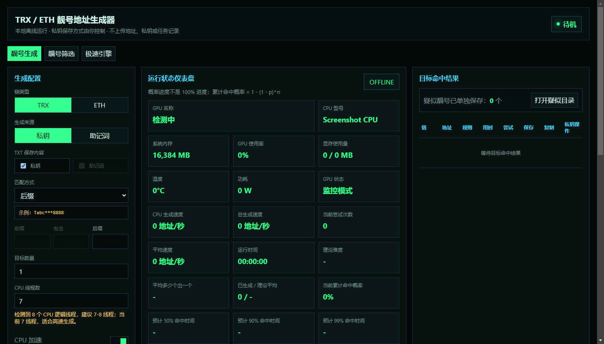
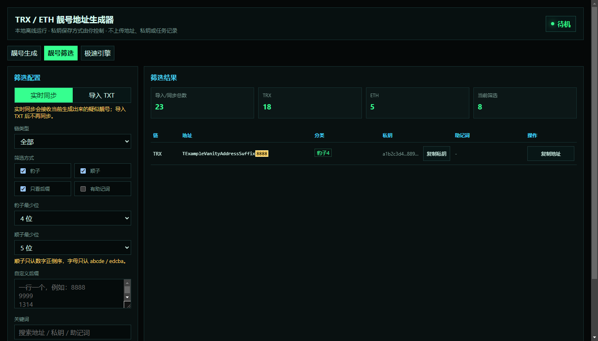
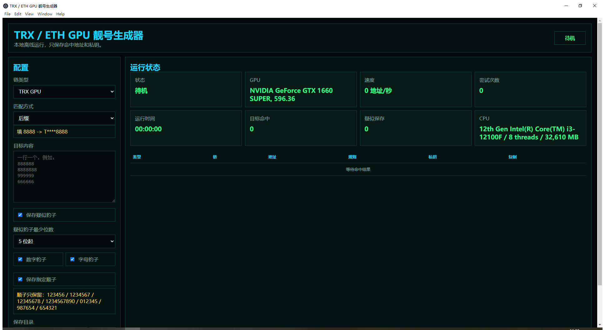

# TRX / ETH 靓号地址生成器

本项目是一个 **本地离线运行** 的 Windows 桌面工具，用来生成 TRX / ETH 靓号钱包地址。  
不联网、不上传私钥、不上传助记词、不上传地址、不上传任务记录。

大白话：你填想要的尾号，比如 `8888`、`666666`、`123456`，软件就在你电脑本地不断生成新地址，命中后只保存命中的地址和私钥。私钥是真实可导入钱包的，所以结果文件一定要自己保管好。

[下载成品软件包](https://github.com/jacksongua8221-cell/trx-eth-vanity-address-studio/releases) ｜ [完整中文说明](./README.zh-CN.md)

## 两个版本

### 1. 标准桌面版（原版保留）

适合要完整桌面功能的人：

- TRX / ETH 地址生成
- 私钥模式、助记词模式、私钥 + 助记词同时保存
- 前缀、后缀、包含、前缀 + 后缀等多种匹配
- CPU 多线程生成
- NVIDIA GPU 状态监控
- 命中概率、理论难度、预计时间
- 自动保存、checkpoint 恢复
- 靓号筛选 Tab：导入 TXT 或实时同步疑似结果

### 2. GPU 极速版（新增）

适合只想高速跑目标靓号的人：

- TRX 使用 OpenCL GPU 核心
- ETH 使用 OpenCL GPU 核心
- 只跑目标地址，命中才保存
- 多个后缀可一行一个同时配置
- TRX 不同后缀长度自动分组启动，避免 5 位、6 位、7 位目标互相干扰
- 疑似豹子可设置 5 位起、6 位起、7 位起等
- 疑似豹子支持数字 / 字母开关
- 指定顺子只保留：`123456`、`1234567`、`12345678`、`1234567890`、`012345`、`987654`、`654321`
- 目标结果保存到 `target.txt`
- 疑似结果保存到 `suspicious.txt`

## 截图

### 标准桌面版 - 靓号生成



### 标准桌面版 - 靓号筛选



### GPU 极速版



## 搜索关键词

```text
TRX 靓号地址生成器
TRON 靓号地址生成器
ETH 靓号地址生成器
Ethereum 靓号地址生成器
钱包靓号生成器
离线靓号地址生成器
TRX vanity address generator
TRON vanity address generator
ETH vanity address generator
Ethereum vanity address generator
OpenCL vanity address
GPU vanity address generator
MetaMask 私钥导入
TronLink 私钥导入
```

## 安全提醒

- 私钥和助记词就是钱包资产凭证，谁拿到谁就能控制钱包。
- 不要把结果 TXT、私钥、助记词、带私钥的截图发给别人。
- 本项目只用于生成你自己的新地址，不是“反推私钥”或“破解钱包”工具。
- 正式收款前，建议先用小额转账测试地址导入和收款是否正常。

## 打赏地址

欢迎大哥打赏：

```text
TEmivtvDDCqiaNW4NvX9B6ngYz9f9U8888
```


## License

MIT
