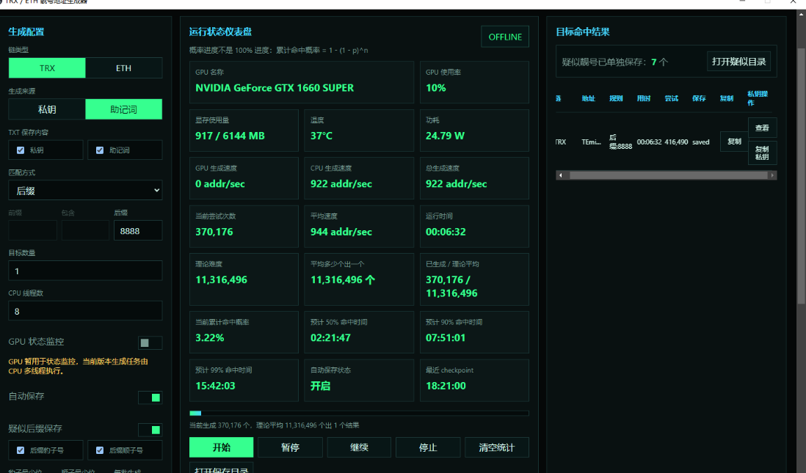

# TRX / ETH 靓号地址生成器

一个本地离线运行的 Windows 桌面工具，用来生成 **TRX / ETH 靓号地址**。项目重点不是花哨，而是：私钥正确、地址可导入真实钱包、运行过程不联网、不上传任何敏感数据。

[English Overview](#english-overview) · [中文详情](./README.zh-CN.md) · [Release 下载](https://github.com/jacksongua8221-cell/trx-eth-vanity-address-studio/releases)

> 本地离线运行。不上传私钥。不上传助记词。不上传地址。不上传任务记录。


## 生成结果与打赏

TRX 后缀 `8888` 的生成结果示例：



欢迎大哥打赏：`TEmivtvDDCqiaNW4NvX9B6ngYz9f9U8888`


## 核心功能

- **支持 TRX / ETH**：生成标准 secp256k1 私钥和对应链地址。
- **钱包可导入**：私钥输出为 64 位十六进制字符串，可用于常见钱包导入。
- **支持私钥 / 助记词来源**：可以选择私钥生成、助记词生成，也可以在助记词模式下同时保存私钥和助记词。
- **多种目标匹配方式**：前缀、后缀、包含、前缀 + 后缀、前缀 + 包含、包含 + 后缀、前缀 + 包含 + 后缀。
- **疑似靓号只看后缀**：支持后缀豹子号、后缀顺子号、自定义后缀，不内置 `dead/beef/cafe` 之类英文词。
- **CPU 多线程生成**：worker 批量生成，减少 UI 消息开销。
- **GPU 状态监控**：读取 NVIDIA GPU 名称、使用率、显存、温度、功耗；当前版本不使用 GPU 参与生成。
- **概率仪表盘**：显示理论难度、累计尝试次数、累计命中概率、预计 50% / 90% / 99% 命中时间。
- **TXT 保存结果**：目标结果和疑似后缀结果分目录保存，默认每行只保留地址和密钥。

## 地址生成规则

**ETH**

```text
私钥 -> secp256k1 公钥 -> Keccak-256 -> 后 20 字节 -> EIP-55 checksum 地址
```

**TRX**

```text
私钥 -> secp256k1 公钥 -> Keccak-256 -> 后 20 字节 -> 前面加 0x41 -> Base58Check -> T 开头地址
```

测试会用 `ethers` 校验 ETH 地址和私钥匹配，用 `TronWeb` 校验 TRX 地址和私钥匹配。

## 下载使用

在 Releases 下载 Windows 便携版：

```text
VanityAddressStudio-v0.1.0-win-portable.zip
```

解压后双击：

```text
TRX_ETH_靓号地址生成器.exe
```

## 从源码运行

```bash
npm install
npm start
```

打包便携版：

```bash
npm run package:portable
```

验证：

```bash
npm test
npm run verify:offline
node scripts/benchmark-workers.js 10 TRX 5
```

## 安全说明

- 程序本地运行，不主动调用网络 API。
- 不上传私钥、助记词、地址或任务记录。
- 私钥加密保存是可选项，由用户自己控制。
- 明文 TXT 导出可用，但导出的文件必须按真实钱包私钥处理。
- 正式使用前建议先用空钱包或小额钱包测试导入流程。

## English Overview

TRX / ETH Vanity Address Studio is an offline Windows desktop vanity address generator for TRON and Ethereum. It creates wallet-importable secp256k1 private keys, derives valid TRX / ETH addresses, keeps target hits and suspicious suffix hits in separate local TXT files, and never uploads private keys, mnemonics, addresses, or task records.

GPU is currently used for status monitoring only. Address generation runs on CPU worker threads.

## License

MIT
