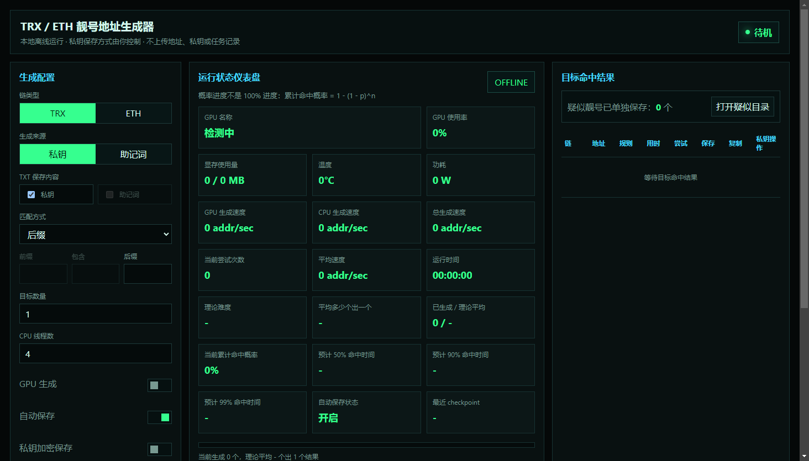

# TRX / ETH 靓号地址生成器

[English README](./README.md)

一个本地离线运行的桌面靓号地址生成器，支持 **TRON / TRX** 和 **Ethereum / ETH**。核心目标是：生成真实钱包可导入的地址，同时不上传私钥、助记词、地址或任务记录。

> 本地运行。不联网。不上传。不托管私钥。



## 功能亮点

- **支持 TRX / ETH**：生成标准 secp256k1 私钥和对应主网地址。
- **钱包可导入**：导出的私钥为 64 位十六进制字符串，适合常见钱包导入。
- **多种匹配方式**：前缀、后缀、包含、前缀 + 后缀、前缀 + 包含、包含 + 后缀、组合规则、智能识别。
- **可选助记词模式**：可以选择私钥生成、助记词生成，也可以在助记词模式下同时保存私钥和助记词。
- **概率仪表盘**：显示理论难度、尝试次数、累计命中概率、预计 50% / 90% / 99% 命中时间、实时速度。
- **GPU 状态面板**：优先读取 NVIDIA `nvidia-smi`；AMD / Intel 预留接口。
- **自动 checkpoint**：运行中定期保存任务状态；随机序列不恢复，但累计统计和已保存结果会延续。
- **疑似靓号单独保存**：目标命中结果进入主列表，疑似靓号独立保存到 suspicious 目录。
- **TXT 结果文件**：默认每行只保留地址和密钥；勾选助记词保存时才追加助记词。

## 地址生成规则

**ETH**

```text
私钥 -> secp256k1 公钥 -> Keccak-256 -> 后 20 字节 -> EIP-55 checksum 地址
```

**TRX**

```text
私钥 -> secp256k1 公钥 -> Keccak-256 -> 后 20 字节 -> 前面加 0x41 -> Base58Check -> T 开头地址
```

测试中会用 `ethers` 校验 ETH 私钥和地址匹配，用 `TronWeb` 校验 TRX 私钥和地址匹配。

## 下载使用

在 Releases 页面下载 Windows 便携版：

```text
TRX_ETH_靓号地址生成器_便携版.zip
```

解压后双击：

```text
TRX_ETH_靓号地址生成器.exe
```

## 从源码运行

```bash
npm install
npm start
```

打包便携版：

```bash
npm run package:portable
```

运行测试和离线扫描：

```bash
npm test
npm run verify:offline
```

## 安全说明

- 程序作为 Electron 桌面应用本地运行。
- 不主动调用网络 API。
- 不上传私钥、助记词、地址或任务记录。
- 私钥加密保存是可选项，由用户自己控制。
- 明文导出可用，但导出的 txt 文件应按真实钱包私钥处理。

## 技术栈

- Electron 桌面端
- Node.js Worker Threads
- `@noble/secp256k1`
- `ethers`
- `tronweb`
- `argon2`
- AES-256-GCM 加密保存

## 风险提示

这是本地密钥生成工具。请妥善保管私钥、助记词、结果文件、备份文件和截图。正式使用前建议先用空钱包或小额钱包测试导入流程。
